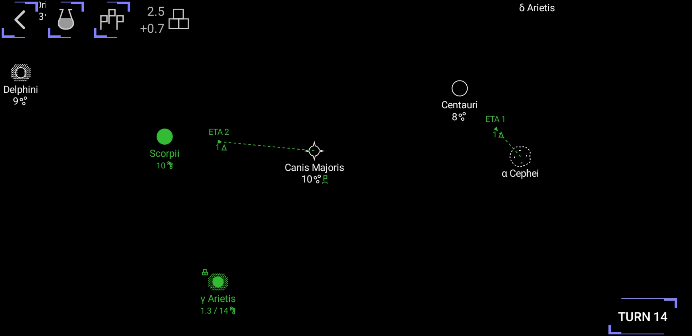

Repository for the Ancient Star wiki, issue tracker, and a discussion board.

[Download and play](https://play.google.com/store/apps/details?id=com.ikcode.ancientstar1)  

[Discord](https://discord.gg/nc66tMS3ZD)  
[Wiki](https://github.com/iktools/Ancient-Star/wiki)  
[Known bugs](https://github.com/iktools/Ancient-Star/issues)  
[Privacy policy](https://iktools.github.io/privacy.htm)

# Ancient Star
Explore the galaxy, expand to new worlds, and compete with other races at unlocking the mysteries of the Ancient Star.

Starting from your homeworld, explore the surrounding stars, expand through the galaxy, and build the mightiest civilization. Meet other civilizations among stars and find a way to coexist. Advance your technology, unlock the mystery behind the Ancient Star, and put your empire to the final test.

Ancient Star features a streamlined 4X experience. 
- Do everything from the galaxy map
- Give orders only when you want to change direction
- No more jumping from one screen to another all the time, get information, and give orders right from the galaxy map. 
- Colonies can develop and be productive on their own, no need to micromanage them.
- Strategic space combat where the type of units matters as much as their number.
